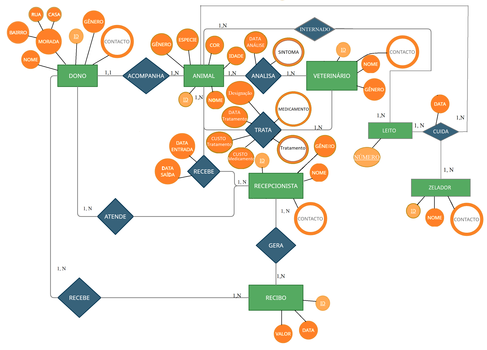

# Base dados Clinica Veterinaria
Base de dados relacional para armazenar dados de uma clínica veterinária (MySQL)

## Descrição da base da dados
A base de dados foi desenvolvida para facilitar o manuseio, armazenamento e controle detalhado das informações recolhidas pela veterinária da cidade de Maputo. Abaixo, apresento as principais entidades e relacionamentos do mini mundo:

#### 1. Dono do Animal:
- Acompanha o animal para a veterinária.
- Dados: Nome, morada, contacto, género.
- Relacionamento: Um dono pode ter muitos animais.

#### 2. Animal:
- Analisado e tratado por veterinários.
- Dados: Código, nome, espécie, cor, raça, peso, género, idade.
- Relacionamentos:
- Pertence a um único dono.
- Pode ocupar um leito durante o internamento.

#### 3. Leito:
- Usado para internar animais.
- Dados: Data de internamento e de alta.
- Relacionamento: Pode ser ocupado por um animal.

#### 4. Zelador:
- Cuida de vários leitos e animais.

#### 5. Veterinário:
- Analisa e trata os animais.
- Dados: ID, nome, género, contacto.
- Relacionamento: Pode analisar/tratar um ou mais animais.

#### 6. Recepcionista:
- Atende o dono na veterinária.
- Gera recibos de custos de tratamentos.
- Dados: ID, nome, género, contacto.
- Relacionamento: Recebe o animal na veterinária.

#### 7. Tratamento:
- Envolve medicamentos, custos, designação e data.
- Relacionamento: Associado a um animal.

#### 8. Medicamento:
- Utilizado no tratamento.
- Relacionamento: Associado a um tratamento.

#### 9. Recibo:
- Gera informações sobre custos.
- Dados: Valor do tratamento e dos medicamentos, data de emissão.
- Relacionamento: É entregue ao dono.

Essa estrutura permite uma gestão abrangente e organizada das informações da veterinária, garantindo o registro preciso de dados relacionados aos animais, donos, tratamentos e custos associados.

## Diagrama Relacional

